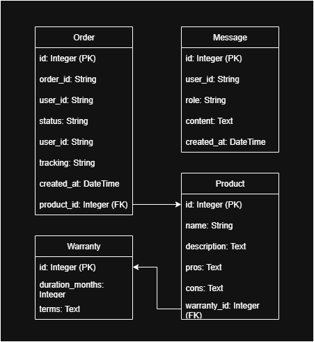

**PERHATIAN**: Kecepatan respons chatbot bergantung pada beberapa hal, contohnya spek hardware yang digunakan. Mohon bersabar menunggu respons chatbot. Apabila masalah berlanjut, ikuti [panduan troubleshoot di bawah](#troubleshooting).

# Instalasi pada Environment Lokal

- Aplikasi FastAPI akan berjalan pada port 8000 dan Ollama pada port 11434.  Pastikan kedua port ini sedang tidak digunakan sebelumnya.
- Pastikan Ollama sudah terinstall. Apabila belum, unduh dari [sini](https://ollama.com/download)
-  Aplikasi akan melalukan seeding database saat start up

## Dengan Docker
```
git clone <this-repo>
cd simple-ecommerce-chatbot

docker-compose up -d

docker-compose exec ollama ollama pull llama3.2:3b
```

## Tanpa Docker
```
git clone <this-repo>
cd simple-ecommerce-chatbot

ollama pull llama3.2:3b
ollama serve

uvicorn src.main:app --reload --host 0.0.0.0 --port 8000
```

Endpoints dapat dicoba melalui: [localhost:8000/docs](localhost:8000/docs)

# Desain Database

## Entity Relationship Diagram



## Daftar Tabel
1. **Messages**
Menyimpan riwayat percakapan antara user dan chatbot.
- id - Primary key
- user_id - Identifier pengguna
- role - Peran (user/assistant/tool)
- content - Isi pesan
- created_at - Timestamp

2. **Orders**
Menyimpan informasi pesanan pelanggan.
- id - Primary key
- order_id - ID unik pesanan (cth: ORD12345)
- user_id - ID pengguna
- status - Status pesanan (Shipped/Processing/Delivered)
- tracking - Nomor tracking
- product_id - Foreign key ke Products
- created_at - Timestamp

3. **Products**
Menyimpan katalog produk.
- id - Primary key (P123)
- name - Nama produk
- description - Deskripsi produk
- pros - Kelebihan produk
- cons - Kekurangan produk
- warranty_id - Foreign key ke Warranties

4. **Warranties**
Menyimpan kebijakan garansi.
- id - Primary key
- duration_months - Durasi garansi dalam bulan
- terms - Syarat dan ketentuan garansi

# Library, Framework, dan LLM

## Backend Framework & API
- FastAPI (>=0.110.0) - Framework web modern untuk membangun API dengan Python
- Uvicorn (0.22.0) - ASGI server untuk menjalankan aplikasi FastAPI
- Pydantic (2.5.0) - Validasi data dan serialization

## Database & ORM
- SQLAlchemy (2.0.23) - Object-Relational Mapping (ORM) untuk Python
- Aiosqlite (0.19.0) - Driver async SQLite untuk Python
- SQLite - Database relational yang ringan (embedded)

## LLM & Integration
- Requests (2.31.0) - HTTP client untuk komunikasi dengan Ollama API
- Ollama - Large Language Model server (dijalankan sebagai service terpisah)
- Llama-3.2:3b - Model bahasa dari Meta dengan 3 miliar parameter

## Configuration Management
- Python-dotenv (1.0.0) - Loading environment variables dari file .env

## Containerization
- Docker - Platform containerization
- Docker Compose - Tool untuk mengelola multi-container applications

## Python Version & Standard Libraries
- Python (3.11) - Bahasa pemrograman utama
- asyncio - Pemrograman asinkronus
- json - Pemrosesan JSON
- re - Regular expressions
- os - Antarmuka sistem operasi
- datetime - Handline tanggal dan waktu
- time - Fungsi yang berhubungan dengan waktu

## Development Tools
- Pip - Package manager untuk Python

# Daftar Pertanyaan yang Dapat Dijawab

1. **Tentang Pesanan**
- Dimana pesanan saya?
- Dimana pesanan dengan nomor ORD12345?
- ORD12345 sudah dimana
- Pesanan saya sudah sampai mana?
- Bagaimana status pesanan saya?

2. **Tentang Produk**
- Apa kelebihan dari Headphone Wireless?
- Apa kekurangan Gaming Laptop Pro?
- Bagaimana detail produk P123?
- Deskripsi produk P123
- Info produk P123

3. **Tentang Garansi**
- Bagaimana cara saya meng-klaim garansi?
- Bagaimana garansi untuk P123?
- Apakah ada jaminan untuk Headphone Wireless?
- Garansi P123
- Warranty P123

# Membuat Request kepada Sistem
Request Body:
```
{
  "user_id": "string",
  "message": "string"
}
```

Contoh Request Body:
```
{
  "user_id": "user1",
  "message": "dimana pesanan saya?"
}
```

Contoh Penggunaan:
```
curl -X POST http://localhost:8000/chat \
  -H "Content-Type: application/json" \
  -d '{
    "user_id": "user1",
    "message": "dimana pesanan saya?"
  }'
```

# Daftar Tool Call yang Dapat Dilakukan
Aplikasi ini memiliki 3 tool utama yang dapat dipanggil secara otomatis berdasarkan input user:

## 1. get_order_status
Mengecek status pesanan berdasarkan order ID atau pesanan terakhir user

**Parameter**:
order_id (string, optional) - ID pesanan (contoh: "ORD12345")
Jika kosong, sistem akan mencari pesanan terakhir user

**Contoh Output**:
```
{
  "found": true,
  "order_id": "ORD12345",
  "status": "Shipped",
  "tracking": "TRACK123",
  "user_id": "user1",
  "product_id": "P123",
  "product_name": "Headphone Wireless"
}
```

**Contoh Trigger Keywords**:
"pesanan", "order", "status", Kode ORD (ORD12345, ORD23456, ORD34567, dll.)

## 2. get_warranty_info
Mengambil informasi garansi produk berdasarkan ID produk atau nama produk

**Parameter**:
product_identifier (string) - ID produk (P123) atau nama produk ("Headphone Wireless")

**Contoh Output**:
```
{
  "product": "Headphone Wireless",
  "product_id": "P123",
  "duration_months": 24,
  "terms": "Hanya mencakup cacat produksi."
}
```

**Trigger Keywords**:
"garansi", "warranty", "jaminan"

## 3. get_product_info
Mengambil informasi detail produk termasuk deskripsi, kelebihan, dan kekurangan
Parameter

**Parameter**:
product_identifier (string) - ID produk (P123) atau nama produk ("Headphone Wireless")

**Contoh Output**:
```
{
  "id": "P123",
  "name": "Headphone Wireless",
  "description": "Headphone wireless berkualitas tinggi dengan noise cancellation.",
  "pros": "Kualitas suara yang bagus; Nyaman dipakai; Baterai tahan lama",
  "cons": "Harga mahal; Case yang besar"
}
```

**Trigger Keywords**:
"kelebihan", "kekurangan", "pros", "cons", "deskripsi", "detail", "about", "info", Kode P (P123, P234, P345, dll.)

## Cara Kerja Tool Call
- **Automatic Detection**: Sistem LLM secara otomatis mendeteksi intent user dan memilih tool yang tepat
- **Smart Matching**: Dapat mengenali produk melalui ID (P123) atau nama parsial ("headphone", "smartphone")
- **Context Awareness**: Menggunakan riwayat percakapan untuk memahami konteks
- **Fallback Logic**: Jika LLM gagal, ada regex fallback untuk pattern penting (cth: ID produk)

# Troubleshooting
## 1. Port Ollama sedang dipakai

**Contoh error**:
```
 Error: listen tcp 127.0.0.1:11434: bind: Only one usage of each socket address (protocol/network address/port) is normally permitted.
```

**Solusi 1**: 
- Linux/MacOS
```
pkill -9 ollama
```
- Windows
```
> Open task manager(CTRL + SHIFT + ESC)
> Search for "Ollama"
> Right-click on "Ollama"
> End task
```

**Solusi 2**:
Gunakan port yang berbeda


## 2. Port FastAPI sedang dipakai

**Contoh error**:
```
OSError: [Errno 98] Address already in use
```

**Solusi 1**: 
- Linux/MacOS
```
lsof -i :8000
kill -9 <PID>
```
- Windows
```
netstat -ano | findstr :8000
taskkill /PID <PID> /F
```

**Solusi 2**:
Gunakan port yang berbeda

## 3. Objek tidak ditemukan/respons model mulai memburuk
**Solusi**: 
- Tanyakan request yang sama sekali lagi
- Apabila masih bermasalah, akses endpoint reset database [localhost:8000/database/reset](localhost:8000/database/reset). PERHATIAN: Akan menghapus data yang ada dan mengisi kembali sesuai data dalam `src/db_seed.py`